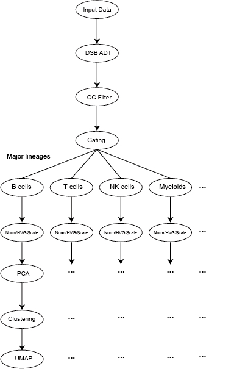

# Ghosn Laboratory 
# SuPERR-Seq
These files are intended to support our manuscript titled "Comprehensive multi-omics single-cell data integration reveals greater heterogeneity in the human immune system".
This work can be found freely available at [bioRxiv](https://www.biorxiv.org/content/10.1101/2021.07.25.453651v2).

- The workflow of SuPERR-Seq is shown below:  
  

- The cellranger filtered GEX and ADT matrices can also be downloaded directly from our data directory [here](https://github.com/Ghosn-Lab/SuPERR-Seq/blob/main/data/raw_GEX%2BADT.RData) in order to fully reproduce the figures and results of our manuscript.

## Normalizing Antibody derived tags (ADT) data
ADT data was normalized using R package "**dsb**" (https://github.com/niaid/dsb). The background population in the cellranger raw feature-barcode matrix of each sample was determined separately after removing cell barcodes that expressed 0 ADT UMIs. The cell barcodes from the cellranger filtered feature-barcode were considered as real cells.

The DSB normalized ADT matrices that also contain the feature of Total VDJ UMIs can be found under the data directory [here](https://github.com/Ghosn-Lab/SuPERR-Seq/tree/main/data/DSB_normalized_ADT)
## Manual Gating of single-cell sequencing data
In the manuscript "Comprehensive multi-omics single-cell data integration reveals greater heterogeneity in the human immune system" we refer to Manual Gating using a customized strategy of biaxal plots, which was implemented in MATLAB.  
Following the code contained in **'Anti_seq_manual_gating_BM.m'** and **'Anti_seq_manual_gating_PBMC.m'**, we can easily reproduce the polygons used to produce the gates, and therefore reproduce the results of the manuscript.
- The major lineages of immune cells were gated using canonical surface protein markers and total UMIs of the VDJ filtered. Cell barcodes that expressed mutually exclusive surface proteins were considered doublets and have been removed from downstream analysis. 

The gating strategy of PBMC can be found under data/Major_Lineages [here](https://github.com/Ghosn-Lab/SuPERR-Seq/blob/main/data/Major%20lineages/PBMC_gating_strategy.png).

The gating strategy of BM can be also found in the same directory [here](https://github.com/Ghosn-Lab/SuPERR-Seq/blob/main/data/Major%20lineages/BM_gating_strategy.png)

## Integration of GEX data
The standard Seurat integration workflow was utilized to generate the integrated matrix: [vignette](https://satijalab.org/seurat/articles/integration_introduction.html.)
## Sub-clustering and classification of each major lineages
After defining the major lineages of each sample and integrating the GEX data, the conventional GEX analysis was done for each major lineage separately. The sub-clusters were annotated based on DEG (Wilcoxon rank-sum test) analyses.
## VDJ analysis
The VDJ analysis was done using cellranger vdj and custom codes, the manual for which is reproduced [here](https://github.com/Ghosn-Lab/SuPERR-Seq/blob/main/tools/VDJ_Analysis/VDJ_Analysis_Manual.pdf). Circos plots were generated by mode 3 in the custom codes. Specifically, we replaced the values of column "**isotype**" in **lineage_processed_data.csv** with cluster labels and ran mode 3 to generate the circos plot in Figure. 6E

## CMS

In the manuscript "Comprehensive multi-omics single-cell data integration reveals greater heterogeneity in the human immune system" we refer to a Cell Misclassification Statistic (**CMS**).
CMS is applied exactly as in our recent publication "Data Matrix Normalization and Merging Strategies Minimize Batch-specific Systemic Variation in scRNA-Seq Data", which is freely available at https://www.biorxiv.org/content/10.1101/2021.08.18.456898v1

This document is intended to guide the user through the steps needed to reproduce the CMS calculation.


The CMS is a scoring metric we apply to evaluate whether cells in a single-cell RNA-seq experiment retain the same classification variable (e.g. cell type, function, state) between replicate dataset analyses.
CMS is presented here exactly as in our complementary work "Data Matrix Normalization and Merging Strategies Minimize Batch-specific Systemic Variation in scRNA-Seq Data" which is freely available at [bioRxiv](https://www.biorxiv.org/content/10.1101/2021.08.18.456898v1).
More details of CMS may be found [here](https://github.com/Ghosn-Lab/BatchNorm)

### Software Requirements

To calculate a CMS score we need only an up-to-date version of base R (tested on R 4.0.5 running on MacOS 11.5)
No special installation is required.

### Example

To calculate a CMS we will need a dataframe "x" containing the cell barcodes and the classifications which we wish to test (one row for each cell).
We provide a small example using demo data here:
The expected runtime for this demo is less than one second.


```
head(x)
>                     	         ID_1       		 ID_2    
 AAACCTGCAAGCGAGT		"B_Cells"	  	"B_Cells"  
 AAACCTGCACACAGAG		"NK_CD56Hi"		"NK_CD56Hi"
 AAACCTGGTAAACACA		"NK"       		"NK"       
 AAACCTGGTCGGATCC		"T_CD8"    		"NK"    
 AAACCTGGTCTCTTTA		"T_CD4"    		"T_CD4"    
 AAACCTGGTTTAAGCC		"NK"       		"NK"
 AAACCTGTCAACACCA		"NK"       		"NK"                
 AAACCTGTCTATCCCG		"Monocyte" 		"Monocyte"
```
1. Find which IDs from workflow 1 match IDs from workflow 2
 ```
 match <- x[, 'ID_1'] == x[, 'ID_2']
 ```

2. Divide the number of matches by the total number of cells
 ``` 
 CMS <- sum(match, na.rm = T) / length(match)
 ```

3. Invert the score so that 1 is 100% mismatch and 0 is 100% match
 ```
 CMS <- 1 - CMS
 print(CMS)
 > 0.125
```
In this example, 7 of 8 cells (87.5%) change classification between analyses (represented by ID_1 and ID_2).
The calculated CMS is 0.125, or to say that a 12.5% rate of misclassification is occurring between analyses.


CMS can be compared between analyses to evaluate the cell classification fidelity of a given dataset analysis workflow.

